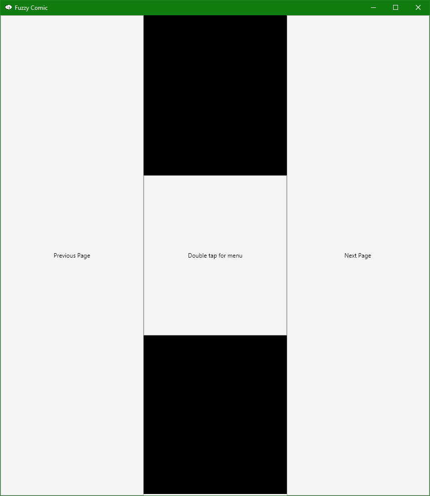

# FuzzyComic




## About

FuzzyComic is intended to be a **simple** comic reader, tailored for use on touch-screen devices.

Currently, it is capable of reading [`.cbz` (comic book zip) and `.cbr` (comic book rar)](https://en.wikipedia.org/wiki/Comic_book_archive) files. It will go through images in the archive in alphanumerical order.

It does _not_ have any fancy library or comics detection built-in. It simply opens files.

It has a small progress bar on the bottom of the screen, and a configurable background color.

## Running

First, you will need to [download .NET Core](https://dotnet.microsoft.com/download) for your operating system.

Before running, you'll have to install dependencies with

```sh
dotnet restore
```

Then, the application can be run with

```sh
dotnet run
```

## Developing

The UI is cross-platform and is built using [Avalonia UI](http://avaloniaui.net/).

Image decompression is done using [SharpCompress](https://github.com/adamhathcock/sharpcompress) which is capable of reading both zip and rar archives. Files are read in a streaming fashion; images are not opened until their page is opened.
